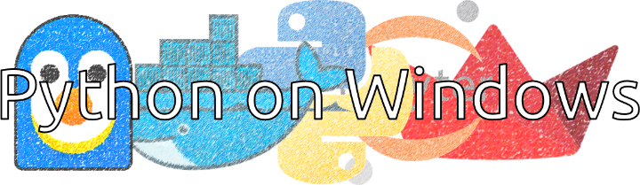

# [atet](https://github.com/atet) / [**_python_**](https://github.com/atet/python/blob/main/README.md#atet--python)

# Setup a Python Environment in One Click!

You are all in for a treat: It used to be **extremely** frustrating to set up a web application development environment years ago, but now you can do it in a single command!

In <10 minutes, we will:
- Set up a self-contained Python installation with Docker
- Tour the Jupyter development environment and learn some basics
- Create a simple web-based application and deploy it on your web browser

*I developed this tutorial on Windows 10; Windows 11 and MacOS should be very similar steps*

----------------------------------------------------------------------------

## Table of Contents

* [0. Requirements](#0-requirements)
* [1. Introduction](#1-introduction)
* [2. Installation](#2-installation)
* [3. Basic Examples](#3-basic-examples)
* [4. Next Steps](#4-next-steps)

### Supplemental

* [Other Resources](#other-resources)
* [Troubleshooting](#troubleshooting)

> NOTE: Make sure there's spacing to allow Markdown to work with HTML elements

Want to ruin the surprise?

- Thing 1
- Thing 2

Want a surprise? (CLICK TO EXPAND)

1. Thing A
2. Thing B

----------------------------------------------------------------------------

## 0. Requirements

REQUIREMENTS.

[Back to Top](#table-of-contents)

----------------------------------------------------------------------------

## 1. Introduction

INTRODUCTION.

[Back to Top](#table-of-contents)

----------------------------------------------------------------------------

## 2. Installation

INSTALLATION.

[Back to Top](#table-of-contents)

----------------------------------------------------------------------------

## 3. Basic Examples

BASIC EXAMPLES.

[Back to Top](#table-of-contents)

----------------------------------------------------------------------------

## 4. Next Steps

NEXT STEPS.

[Back to Top](#table-of-contents)

----------------------------------------------------------------------------

## Other Resources

**Description** | **URL Link**
--- | ---
null | null

[Back to Top](#table-of-contents)

----------------------------------------------------------------------------

## Troubleshooting

Issue | Solution
--- | ---
**"It's not working!"** | This concise tutorial has distilled hours of sweat, tears, and troubleshooting; _it can't not work_

[Back to Top](#table-of-contents)

----------------------------------------------------------------------------

Copyright © 2025-∞ Athit Kao, <a href="http://www.athitkao.com/tos.html" target="_blank">Terms and Conditions</a>
